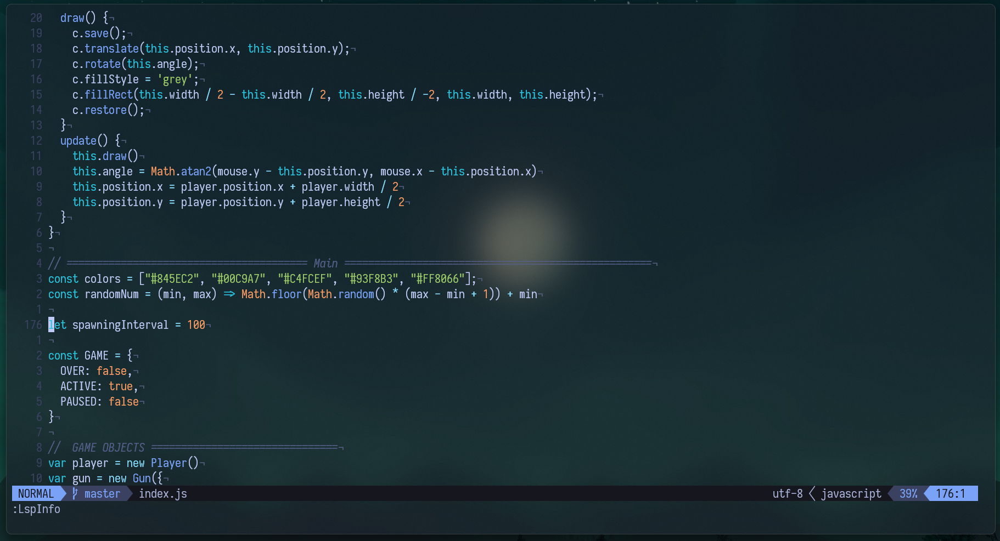
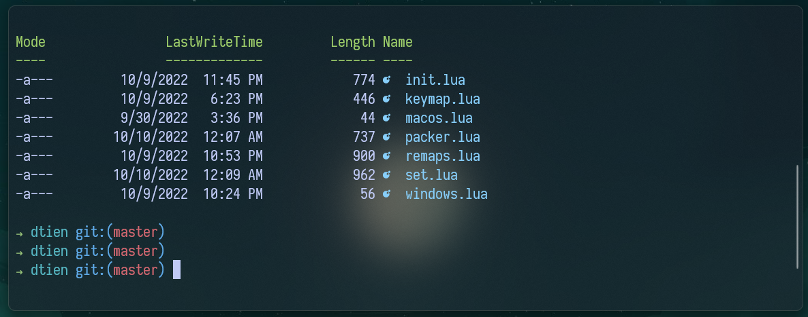

# my dotfiles

## Neovim setup (Requires nvim >= 7.0 using [packer.nvim](https://github.com/wbthomason/packer.nvim))

## Powershell setup
   - [Oh My Posh](https://ohmyposh.dev/) 
   - [Terminal Icons](https://github.com/devblackops/Terminal-Icons)
